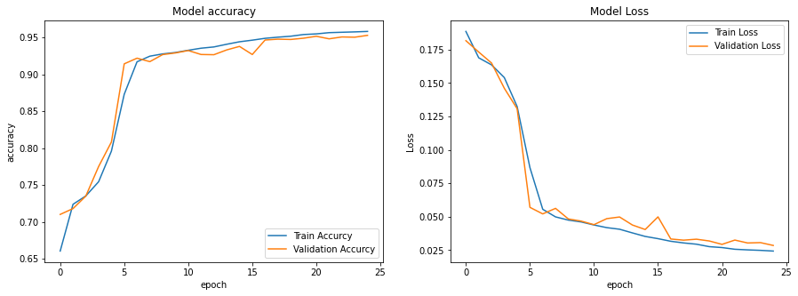

# Face Skin Segmentation Using U-NET

Implementation Of CNN U-NET Architecture With Keras And Tensorflow :snake::eyes:

[CelebA-HQ](https://drive.google.com/file/d/1badu11NqxGf6qM3PTTooQDJvQbejgbTv/view?usp=sharing) Dataset Was Used To Get Face Skin Masks And Train The DNN on New Dataset [SkinDataset-Celeba](https://drive.google.com/file/d/1CADWWyk8J2_LJjcCE-YgGonMYs-TsZql/view?usp=sharing)
The Dataset That Used In This Project Has 12476 Images And it's Masks.
You Can Find Indices File [Here](https://drive.google.com/file/d/1-2ayf0QSxua-8WUaCAJhHfsoQNnI83A2/view?usp=sharing)

---
Accurcy & Loss Curves

---
Also The Trained Model Is Available [Here](https://drive.google.com/file/d/1QQuCsQO1XkEb7pyh2M02hRI0rT7hSPm-/view?usp=sharing)

Enjoy :smile::yellow_heart:
